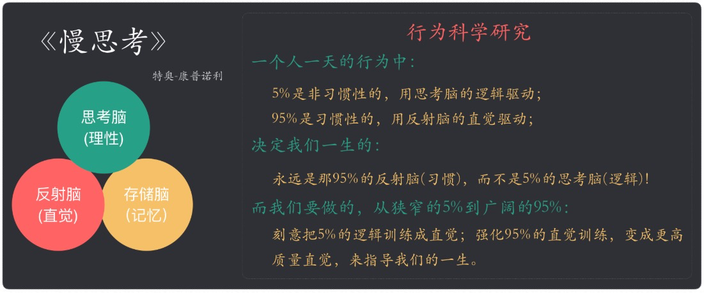
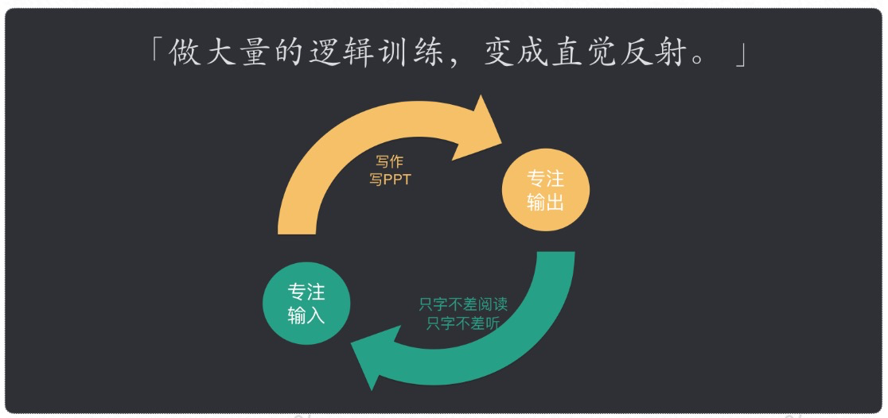

## 什么是认知升级？

 **我对认知升级的定义：认知升级是连接，连接优秀的思维方式，连接解决问题的最短路径，连接一切优秀的方法。**比如：**说到时间管理立马连接到“找到不被打扰的时间用于投资自己”、说到执行力立马连接到“先想明白，然后一步步做下去”、说到改变习惯立马连接到“在触发条件发生进入下一个行为时，做对选择题”**。

## 思考脑与反射脑

做好两件事：

1. 专注输入：做好只字不差的阅读，只字不差地听。对比自己的逻辑和作者的逻辑差异，训练逻辑思考。
2. 专注输出：定期做PPT分享。逻辑抽象训练，大量训练变成直觉反射。

## 习以为常

